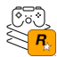

 
Rockstar Games Plugin for GameLib.NET
======

[Rockstar Games](https://www.rockstargames.com/) plugin for  [GameLib.NET](README.md).

The plugin will deliver information about the installation status of the `Rockstar Games` launcher as well the installed games within the launcher.

## Installing

The plugin is already bundled with the core library  [GameLib.NET](README.md)

## Additional information the plugin is providing

To get the additonal information this plugin is providing just cast `IGame` to `RockstarGame`.


```CSharp
using GameLib;
using GameLib.Plugin.Rockstar;
using GameLib.Plugin.Rockstar.Model;

var launcherManager = new LauncherManager();

// not required to cast here just to add to the documentation
var launcher = (RockstarLauncher?)launcherManager.GetLaunchers()
    .Where(launcher => launcher.Name == "Rockstar Games")
    // Plugin ID could also be used instead of the name
    //.Where(launcher => launcher.Id == new Guid("7A24C50D-4D48-4B56-BEF4-5EBDC0B107EC"))
    .FirstOrDefault();

if (launcher is not null)
{
    var games = (IEnumerable<RockstarGame>)launcher.Games;
    foreach (var game in games)
    {
        // Write additional data Rockstar Games is providing for a game besides from the IGame interface
        Console.WriteLine($"\nGame");
        Console.WriteLine($"\tVersion: {game.Version}");
    }
}
```