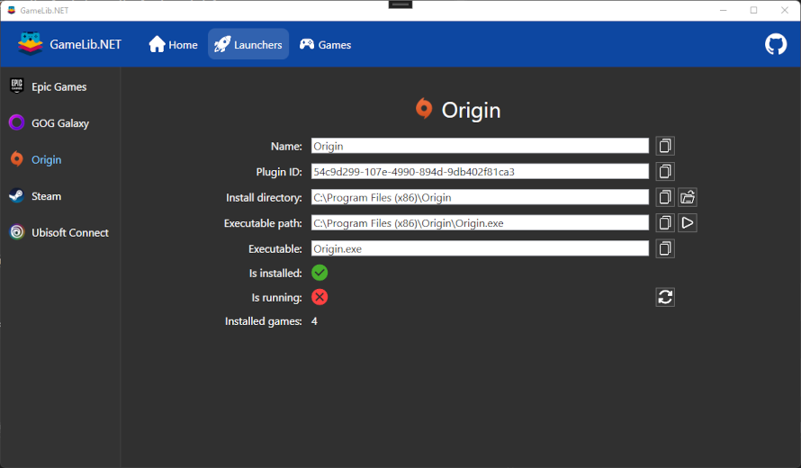
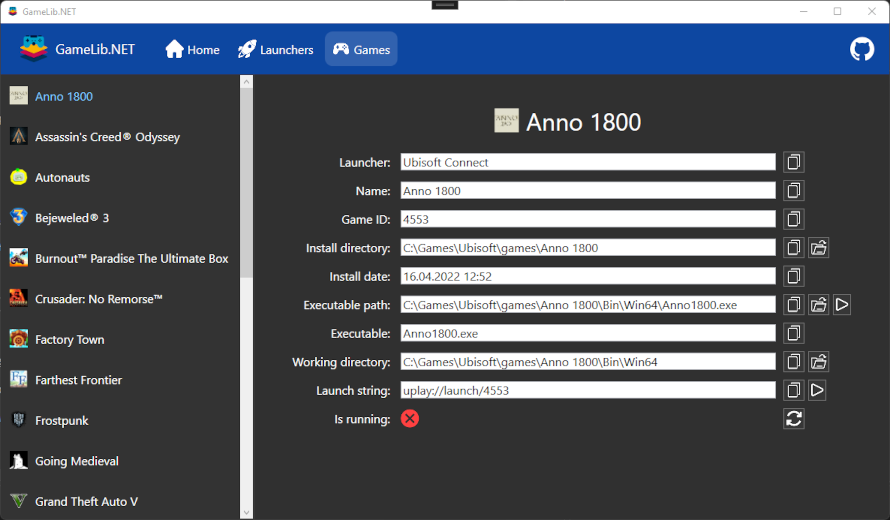

GameLib.NET
======

<p>
  <a href="https://github.com/tekgator/GameLib.NET/blob/main/LICENSE" alt="License">
    
  </a>
  
  <a href="https://www.nuget.org/packages/GameLib.NET" alt="Nuget">
    
  </a>
  <a href="https://github.com/tekgator/GameLib.NET/actions/workflows/build-on-push.yml" alt="BuildStatus">
    
  </a>
  <a href="https://github.com/tekgator/GameLib.NET/releases" alt="Releases">
    
  </a>
  <a href="https://github.com/tekgator/GameLib.NET/releases" alt="Releases">
    
  </a>
  <a href="https://github.com/tekgator/GameLib.NET/commit" alt="Commit">
    
  </a>
</p>

GameLib.NET is a library to give .NET developers easy access to the users installed game launchers and installed games. The motivation for the library is a tool I'm currently working on which requires access to all game executables on a PC.

While this repository is providing already the plugins to gather the games from the most popular game launchers, it easily extendible via the MEF Framework. A developer guide will follow, but I'm pretty sure the geeks will find out themselfes on how to do it.

## Support

I try to be responsive to [Stack Overflow questions in the `gamelib-net` tag](https://stackoverflow.com/questions/tagged/gamelib-net) and [issues logged on this GitHub repository](https://github.com/tekgator/GameLib.NET/issues).

If I've helped you and you like some of my work, feel free to buy me a coffee ☕ (or more likely a beer 🍺)

<a href='https://ko-fi.com/C0C7LO3V1' target='_blank'></a>


## Plugins

Following plugins are already bundled with GameLib.NET to detect the game launchers including their installed games:

-  [Steam](GameLib.Plugin/GameLib.Plugin.Steam)
-  [Epic Games](GameLib.Plugin/GameLib.Plugin.Epic)
-  [Ubisoft Connect](GameLib.Plugin/GameLib.Plugin.Ubisoft)
-  [Origin](GameLib.Plugin/GameLib.Plugin.Origin)
-  [GOG Galaxy 2.0](GameLib.Plugin/GameLib.Plugin.Gog)
-  [Battle.net](GameLib.Plugin/GameLib.Plugin.BattleNet)
-  [Rockstar](GameLib.Plugin/GameLib.Plugin.Rockstar)

## Installing

Multiple options are available to install within your project:

1. Install, using the [Nuget Gallery](https://www.nuget.org/packages/GameLib.NET)

2. Install using the Package Manager Console:
   ```ps
   Install-Package GameLib.NET 
   ```
3. Install using .NET CLI
   ```cmd
   dotnet add package GameLib.NET
   ```

## Usage

GameLib.NET provides a `LauncherManager` class which has to be instantiated, optionally `LauncherOptions` can be supplied. Each Plugin will provide an interface instance for the launcher `ILauncher` as well an interface instance for `IEnumerable<Game>`.

```CSharp
using GameLib;

var launcherManager = new LauncherManager(new LauncherOptions() { QueryOnlineData = true });

foreach (var launcher in launcherManager.GetLaunchers())
{
    Console.WriteLine($"Launcher name: {launcher.Name}");
    Console.WriteLine("Games:");

    foreach (var game in launcher.Games)
    {
        Console.WriteLine($"Game ID: {game.GameId}");
        foreach (var item in game.GetType().GetProperties().Where(p => p.Name != "GameId"))
        {
            Console.WriteLine($"\t{item.Name}: {item.GetValue(game)}");
        }
    }
}

```

**Please note:** All values are cached within each launcher to save computing time on the next call. If you like to get refreshed values (e.g. new game installed while the lib is running) the `Refresh()` Method on the `LauncherManager` or on the actual `ILauncher` has to be called.


### What launcher / game information is the library providing?

To make a long story short have a look at the [`ILauncher`](GameLib.Core/ILauncher.cs) interface as well as the [`IGame`](GameLib.Core/IGame.cs) interface to see what values are returned by default. Each plugin can provide more information, which can be found in the README.md the corresponding plugin.

**Please note:** Not all launchers will fill all properties in the ``IGame`` interface instance. Further information are provided in the README.md of each plugin.

## Demo application

Have a look at the [Console Demo](GameLib.Demo/GameLib.Demo.Console) as well as the [WPF GUI Demo](GameLib.Demo/GameLib.Demo.Wpf) within the repository.
Both will run straight out of the box to give you a hint what the library can do for you.






## Dependencies and Credits

- Teneko's [Teronis.DotNet](https://github.com/teneko/Teronis.DotNet/tree/develop/src/MSBuild/Packaging/ProjectBuildInPackage) for allowing project reference content to be added to the NuGet package during pack process

- [Josef Nemec](https://github.com/JosefNemec) and contributers of [Playnite](https://github.com/JosefNemec/Playnite) for the inspiration of decoding the proprietary manifest and catalog data of each launcher

- The team of [SteamDB](https://steamdb.info) providing [Valve's KeyValue for .NET](https://github.com/SteamDatabase/ValveKeyValue) for reading Steam's proprietary key value format files

- Protocol buffer deserializing by [protobuf-net](https://github.com/protobuf-net/protobuf-net)

- JSON deserializing by [Json.NET](https://www.newtonsoft.com/json)

- YAML deserializing by [YamlDotNet](https://github.com/aaubry/YamlDotNet)

- Icons are provided by [Flat Icons](https://www.flaticon.com)
